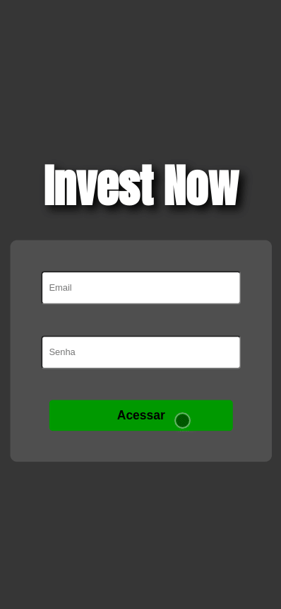

# Boas vindas ao repositório do projeto Invest Now

Invest Now é uma simulação de uma aplicação Front-End, onde é simulado uma sistema de ações.

Acesse pelo SmartPhone: https://case-invest-now.herokuapp.com/

<strong>O sistema é composto de 4 telas: Login, Ações, Compra/Venda e Depósito</strong>

<strong>Cobertura de Testes</strong>

<image src='./public/images/Screenshot from 2022-07-24 15-26-45.png' alt='cobertura dos testes'/>

  
<strong>Como utilizar</strong>
 

  Para utilizar nossa aplicação é bem simples, basta acessar pelo celular o link: https://case-invest-now.herokuapp.com/  

  Para utilizar pelo computador, deverá se atentar em alguns pontos, nossa aplicação foi feita para dispositivies móveis e por esse motivo, inicialmete a tela irá ficar feia e distorcida, para conseguir acessar pelo computador é necessário abra o inspecionar clicando com o botão direito do mouse e selecione a opção " inspecionar " ou então pode apertar o botão f12 do seu teclado.  

  Agora com o inspecionar aberto, no cantinho superior esquerdo, tem um ícone de dispositivos móveis, clique nesse ícone. Caso a aplicação não tenha ficado parecido com as imagens exibidas acima, o inspecionar abre uma barra escrito " Dimensions: ", nesse campo você pode escolher qual o tipo de equipamento será exibido, então para um bom funcionamento recomendo que selecione " Iphone XR ". Agora deve estar tudo certo!  

  <strong>Página de Login:</strong>  
  Na tela de Login, é necessário inserir um email no formato ' alguem@email.com'.  
  Na tela de Login, é necessário inserir uma senha de pelo menos 8 caracteres.  
    **Em caso de informações inválidas iŕa disparar um aviso.  
  Após a inserção dos dados válidos, so acessar a aplicação utilizando o botão "Acessar" logo abaixo. 

  <strong>Ações:</strong>  
  Na tela de Acões é exibida toda a lista de ações que estão disponiveis, e caso já tenha alguma ação na sua carteira, será listado também nessa tela.  

  Nessa tela, temos o botao em azul "C" (compra), ao clicar nesse botão você será redirecionado para a página de compra e venda, onde você pode selecionar a opção "Comprar" ou "Vender", logo abaixo você tem um campo que pode inserir o valor númerico de sua escolha.  

  Para Finalizar a compra/venda é necessário clicar no botão "Confirmar", após você ainda continuará nessa página e pode clicar no botão "Voltar", para voltar a página de Ações. Agora repare que acima tem sua lista de ações compradas.  

  <strong>Compra/Venda:</strong>  
  Nessa tela você pode selecionar a opção "Comprar" ou "Vender", logo abaixo você tem um campo que pode inserir o valor númerico de sua escolha. 

  Para concluir a compra/venda, é necessário clicar no botão "Confirmar", mas se atente que ainda vai ficar nessa tela, para voltar para a tela de Ações é necessário clicar no botão "Voltar". 

  <strong>Depósito:</strong>  
  Nessa tela você pode inserir um valor a sua conta, para isso você tem um campo onde pode inserior o valor desejado, após ter inserido o valor, é necessário que clique no botao "Confirmar", para enfim, confirmar seu depósito. Note que nesse momento ainda não temos a opção de Saque ( Retirada ).  

  
<strong>Durante o desenvolvimento</strong>
 

  A principal fase do meu desenvolvimento começou ao receber o case, ao receber o case eu tirei um tempo de qualidade para analisar o que era pedido, ao analisar e entender o que estava sendo pedido, eu pude separar em requisitos e também analisar quais ferramentas eu usaria para desenvolver aquela proposta.   

  Antes de começar o desenvolvimento eu criei minha estrutura de pastas para trabalhar, components ( aqui fica todos os componentes que fora usados nas páginas ), context ( aqui fica a criação e o provider da minha aplicação ), Style-Components ( aqui fica os elementos estilizados ) e também a pasta utils ( onde ficaria lógicas extras, que no caso usei para armazenar a lógica de validação do email ao fazer o Login ).  

  Durante a análise do case, eu pude separar os elementos das páginas em requisitos, também comecei a pensar em quais ferramentas eu gostaria de trabalhar.   

  Como ferramentas eu escolhi as técnologias, React, ContextAPI, React Hooks, RTL para testes unitários, Styled Components para estilização e Heroku para Deploy.   

  Apesar de nunca ter utilizado o Styled Components antes ( e nem sabia o que era ), depois de algumas horas assistindo alguns videos sobre, eu consegui trabalhar de uma forma muito tranquila e gostei muito dessa técnologia para desenolvimento de estilização.  

  A fase de análise do case e das telas propostas foi essencial e me direcionou pois antes mesmo de começar eu já sabia por exemplo que a página de Ações iria ter dois componentes, um para ações do usuário e outro para ações dispóniveis.   

  <strong>Dificuldades durante o desenvolvimento:</strong>  
  Nesse Case tive algumas dificuldades, a primeira delas foi a organização de tempo, logo no inicio do case tivemos um trabalho na Trybe, então eu tive que organizar o meu tempo para dá conta dos dois, inicialmente eu pensei em dividir o dia metade para Trybe e metade para me dedicar ao Case. Mas logo que saiu o Readme do projeto proposto pela Trybe, também tirei um tempo de qualidade para eu analisar, após analisar eu vi que seria capaz de cumprir todos os requisitos obrigatórios no mesmo dia. Então na segunda feira eu tirei o dia inteiro para me dedicar inteiramente a esse projeto com a meta de finalizar. Graças a Deus tudo deu certo e eu consegui finalizar  o projeto na segunda-feira. 

  Na terça-feira que eu tinha me programado para me dedicar inteiramente ao Case, infelizmente tive problemas de rede. Fiquei sem internet até quarta-feira pela manhã. 

  Na quarta-feira quando a internet voltou eu pude então continuar meu desenvolvimento do case, meu desenvolvimento foi por etapas, primeiro eu fiz as telas, depois os testes, depois estilização.  

  Durante a construção das telas eu pude logo no começo sentir dificuldades pelo fato de que as tecnologias que eu usaria para desenvolver esse Case, já fazia um tempo que eu tinha estudado, ai então pausei o desenvolvimento do case e organizei uma pequena listinha de revisão. Revi os conteus de React, ContextAPI, React Hooks e RTL para testes unitários. 

  Tive algumas dificuldades com o código em alguns momentos, um deles foi quando precisava pegar a ação para mandar para a tela de compra/venda. Nesse momento fiquei travado tentando de várias formas pegar os dados da Ação. Mas logo que deixei essa parte para depois e fui me concentrar em outra tela, tive uma ideia que me ajudou nesse desafio, consegui acessar o título da ação pelo atributo name do meu botão.  

  Outro grande desafio foi salvar as ações compradas, fiquei horas e horas nessa parte. Até que tive a ideia de salvar em uma lista utilizando o método push. 

  Agora estava conseguindo salvar e listar na tela todas as ações compradas, mas tive outro grande problema que esse não consegui resolver e estou me sentindo super frustado de ter que entregar o desafio com essa pendência, ao comprar o mesmo ativo ele fica duplicado na lista de meus Ativos, infelizmente não consegui resolver essa pendência.  

  Também não consegui fazer funcionar corretamente a opção de venda, pelo fato de que não estava conseguindo acessar o elemento corrento na lista de ações. 

  Tive dificuldades com testes, mas depois de um pouco de estudo e revisão os testes fluiram. Consegui fazer todo o teste das 4 páginas pegando no minimo 80% de cobertura. 

  
<strong>Outras informações</strong>
 

  Este case me serviu de grande aprendizado e o maior deles não foi sobre códigos, foi como a gente se comporta em meios a desafios, pois estava enfrentando meu primeiro case real de processo seletivo e ser um candidato concorrendo a vaga com pessoas super capacitadas, durante essa ultima semana foi uma batalha emocional imensa, mas serviu para eu mostrar para mim mesmo que consigo controlar e aprender com minhas emoções, apesar de ter enfrentado alguns desafios de código que não consegui resolver e estar entregando o case com alguns detalhes que eu queria muito ter conseguido fazer.  

